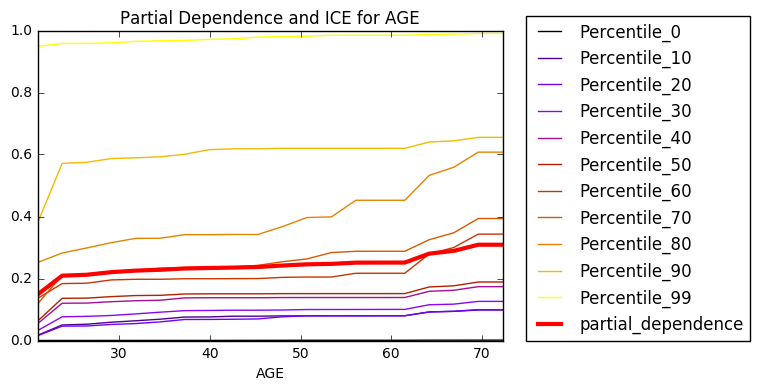
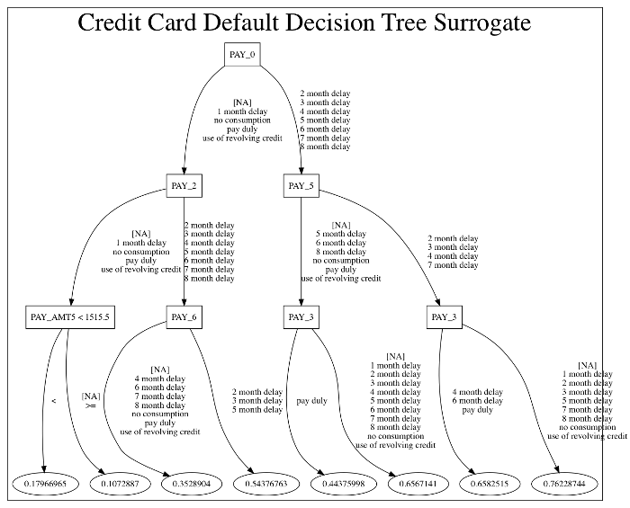
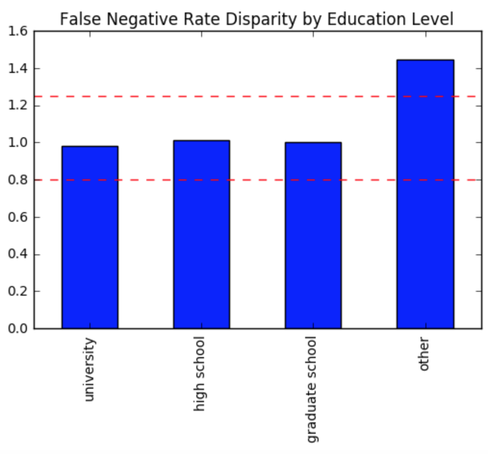
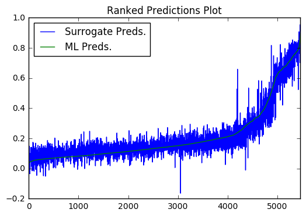
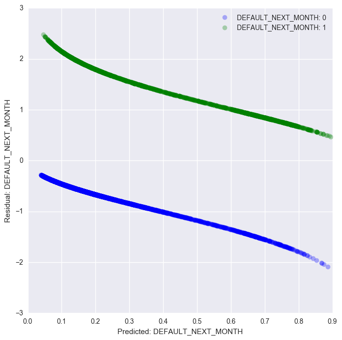
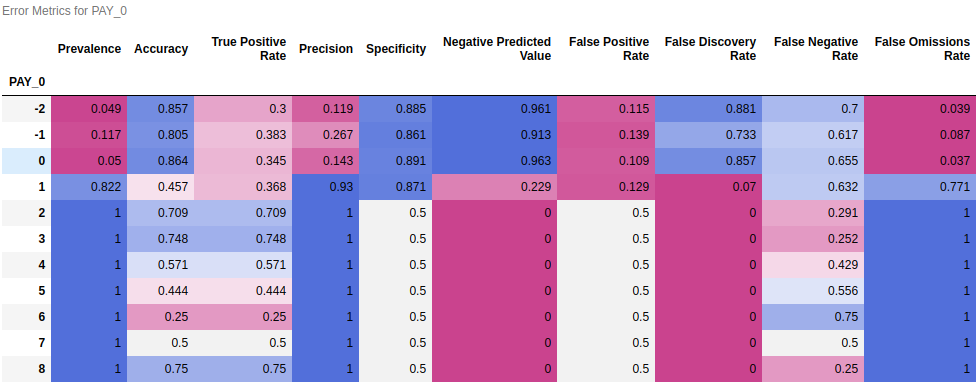
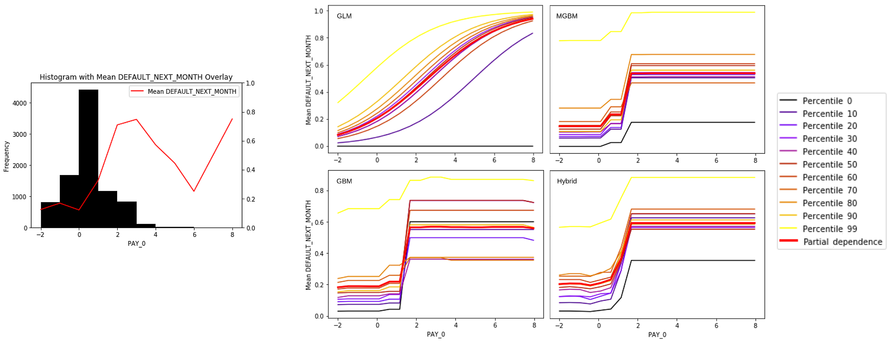

# Responsible Machine Learning with Python
Examples of techniques for training interpretable machine learning (ML) models, explaining ML models, and debugging ML models for accuracy, discrimination, and security.

### Overview

Usage of artificial intelligence (AI) and ML models is likely to become more commonplace as larger swaths of the economy embrace automation and data-driven decision-making. While these predictive systems can be quite accurate, they have often been inscrutable and unappealable black boxes that produce only numeric predictions with no accompanying explanations. Unfortunately, recent studies and recent events have drawn attention to mathematical and sociological flaws in prominent weak AI and ML systems, but practitioners don’t often have the right tools to pry open ML models and debug them. This series of notebooks introduces several approaches that increase transparency, accountability, and trustworthiness in ML models. If you are a data scientist or analyst and you want to train accurate, interpretable ML models, explain ML models to your customers or managers, test those models for security vulnerabilities or social discrimination, or if you have concerns about documentation, validation, or regulatory requirements, then this series of Jupyter notebooks is for you! (But *please* don't take these notebooks or associated materials as legal compliance advice.)

The notebooks highlight techniques such as:
* [Monotonic XGBoost models, partial dependence, individual conditional expectation plots, and Shapley explanations](https://github.com/jphall663/interpretable_machine_learning_with_python#enhancing-transparency-in-machine-learning-models-with-python-and-xgboost---notebook)
* [Decision tree surrogates, reason codes, and ensembles of explanations](https://github.com/jphall663/interpretable_machine_learning_with_python#increase-transparency-and-accountability-in-your-machine-learning-project-with-python---notebook)
* [Disparate impact analysis](https://github.com/jphall663/interpretable_machine_learning_with_python#increase-fairness-in-your-machine-learning-project-with-disparate-impact-analysis-using-python-and-h2o---notebook)
* [LIME](https://github.com/jphall663/interpretable_machine_learning_with_python#explain-your-predictive-models-to-business-stakeholders-with-lime-using-python-and-h2o---notebook)
* [Sensitivity and residual analysis](https://github.com/jphall663/interpretable_machine_learning_with_python#testing-machine-learning-models-for-accuracy-trustworthiness-and-stability-with-python-and-h2o---notebook)
  * [Advanced sensitivity analysis for model debugging](https://github.com/jphall663/interpretable_machine_learning_with_python#part-1-sensitivity-analysis---notebook)
  * [Advanced residual analysis for model debugging](https://github.com/jphall663/interpretable_machine_learning_with_python#part-2-residual-analysis---notebook)
* [Detailed model comparison and model selection by cross-validated ranking](https://github.com/jphall663/interpretable_machine_learning_with_python#from-glm-to-gbm-the-business-value-of-a-better-model---notebook)

The notebooks can be accessed through:
* [H2O Aquarium (Recommended)](https://github.com/jphall663/interpretable_machine_learning_with_python#h2o-aquarium-recommended)
* [Virtualenv (Advanced)](https://github.com/jphall663/interpretable_machine_learning_with_python#virtualenv-installation)
* [Docker container (Advanced)](https://github.com/jphall663/interpretable_machine_learning_with_python#docker-installation)
* [Manual installation (Advanced)](https://github.com/jphall663/interpretable_machine_learning_with_python#manual-installation)

#### Further reading:
* [*Machine Learning: Considerations for fairly and transparently expanding access to credit*](http://info.h2o.ai/rs/644-PKX-778/images/Machine%20Learning%20-%20Considerations%20for%20Fairly%20and%20Transparently%20Expanding%20Access%20to%20Credit.pdf)
* [*A Responsible Machine Learning Workflow with Focus on Interpretable Models, Post-hoc Explanation, and Discrimination Testing*](https://www.mdpi.com/2078-2489/11/3/137)
* [*An Introduction to Machine Learning Interpretability, 2nd Edition*](https://www.h2o.ai/wp-content/uploads/2019/08/An-Introduction-to-Machine-Learning-Interpretability-Second-Edition.pdf)
* [*On the Art and Science of Explainable Machine Learning*](https://arxiv.org/pdf/1810.02909.pdf)
* [*Proposals for model vulnerability and security*](https://www.oreilly.com/ideas/proposals-for-model-vulnerability-and-security)
* [*Proposed Guidelines for the Responsible Use of Explainable Machine Learning*](https://arxiv.org/pdf/1906.03533.pdf)
* [*Real-World Strategies for Model Debugging*](https://medium.com/@jphall_22520/strategies-for-model-debugging-aa822f1097ce)
* [*Warning Signs: Security and Privacy in an Age of Machine Learning*](https://fpf.org/wp-content/uploads/2019/09/FPF_WarningSigns_Report.pdf)
* [*Why you should care about debugging machine learning models*](https://www.oreilly.com/radar/why-you-should-care-about-debugging-machine-learning-models/)

***

### Enhancing Transparency in Machine Learning Models with Python and XGBoost - [Notebook](https://nbviewer.jupyter.org/github/jphall663/interpretable_machine_learning_with_python/blob/master/xgboost_pdp_ice.ipynb)

Monotonicity constraints can turn opaque, complex models into transparent, and potentially regulator-approved models, by ensuring predictions only increase or only decrease for any change in a given input variable. In this notebook, I will demonstrate how to use monotonicity constraints in the popular open source gradient boosting package XGBoost to train an interpretable and accurate nonlinear classifier on the UCI credit card default data.

Once we have trained a monotonic XGBoost model, we will use partial dependence plots and individual conditional expectation (ICE) plots to investigate the internal mechanisms of the model and to verify its monotonic behavior. Partial dependence plots show us the way machine-learned response functions change based on the values of one or two input variables of interest while averaging out the effects of all other input variables. ICE plots can be used to create more localized descriptions of model predictions, and ICE plots pair nicely with partial dependence plots. An example of generating regulator mandated reason codes from high fidelity Shapley explanations for any model prediction is also presented. The combination of monotonic XGBoost, partial dependence, ICE, and Shapley explanations is likely one of the most direct ways to create an interpretable machine learning model today.

### Increase Transparency and Accountability in Your Machine Learning Project with Python - [Notebook](https://nbviewer.jupyter.org/github/jphall663/interpretable_machine_learning_with_python/blob/master/dt_surrogate_loco.ipynb)

Gradient boosting machines (GBMs) and other complex machine learning models are popular and accurate prediction tools, but they can be difficult to interpret. Surrogate models, feature importance, and reason codes can be used to explain and increase transparency in machine learning models. In this notebook, we will train a GBM on the UCI credit card default data. Then we’ll train a decision tree surrogate model on the original inputs and predictions of the complex GBM model and see how the variable importance and interactions displayed in the surrogate model yield an overall, approximate flowchart of the complex model’s predictions. We will also analyze the global variable importance of the GBM and compare this information to the surrogate model, our domain expertise, and our reasonable expectations.

To get a better picture of the complex model’s local behavior and to enhance the accountability of the model’s predictions, we will use a variant of the leave-one-covariate-out (LOCO) technique. LOCO enables us to calculate the local contribution each input variable makes toward each model prediction. We will then rank the local contributions to generate reason codes that describe, in plain English, the model’s decision process for every prediction.

### Increase Fairness in Your Machine Learning Project with Disparate Impact Analysis using Python and H2O - [Notebook](https://nbviewer.jupyter.org/github/jphall663/interpretable_machine_learning_with_python/blob/master/dia.ipynb)

Fairness is an incredibly important, but highly complex entity. So much so that leading scholars have yet to agree on a strict definition. However, there is a practical way to discuss and handle observational fairness, or how your model predictions affect different groups of people. This procedure is often known as disparate impact analysis (DIA). DIA is far from perfect, as it relies heavily on user-defined thresholds and reference levels to measure disparity and does not attempt to remediate disparity or provide information on sources of disparity, but it is a fairly straightforward method to quantify your model’s behavior across sensitive demographic segments or other potentially interesting groups of observations. Some types of DIA are also an accepted, regulation-compliant tool for fair-lending purposes in the U.S. financial services industry. If it’s good enough for multibillion-dollar credit portfolios, it’s probably good enough for your project.

This example DIA notebook starts by training a monotonic gradient boosting machine (GBM) classifier on the UCI credit card default data using the popular open source library, h2o. A probability cutoff for making credit decisions is selected by maximizing the F1 statistic and confusion matrices are generated to summarize the GBM’s decisions across men and women. A basic DIA procedure is then conducted using the information stored in the confusion matrices and some traditional fair lending measures.

### Explain Your Predictive Models to Business Stakeholders with LIME using Python and H2O - [Notebook](https://nbviewer.jupyter.org/github/jphall663/interpretable_machine_learning_with_python/blob/master/lime.ipynb)

Machine learning can create very accurate predictive models, but these models can be almost impossible to explain to your boss, your customers, or even your regulators. This notebook will use (Local Interpretable Model-agnostic Explanations) LIME to increase transparency and accountability in a complex GBM model trained on the UCI credit card default data. LIME is a method for building linear surrogate models for local regions in a data set, often single rows of data. LIME sheds light on how model predictions are made and describes local model mechanisms for specific rows of data. Because the LIME sampling process may feel abstract to some practitioners, this notebook will also introduce a more straightforward method of creating local samples for LIME.

Once local samples have been generated, we will fit LIME models to understand local trends in the complex model’s predictions. LIME can also tell us the local contribution of each input variable toward each model prediction, and these contributions can be sorted to create reason codes -- plain English explanations of every model prediction. We will also validate the fit of the LIME model to enhance trust in our explanations using the local model’s R2 statistic and a ranked prediction plot.

### Testing Machine Learning Models for Accuracy, Trustworthiness, and Stability with Python and H2O - [Notebook](https://nbviewer.jupyter.org/github/jphall663/interpretable_machine_learning_with_python/blob/master/resid_sens_analysis.ipynb)

Because ML model predictions can vary drastically for small changes in input variable values, especially outside of training input domains, sensitivity analysis is perhaps the most important validation technique for increasing trust in ML model predictions. Sensitivity analysis investigates whether model behavior and outputs remain stable when input data is intentionally perturbed, or other changes are simulated in input data. In this notebook, we will enhance trust in a complex credit default model by testing and debugging its predictions with sensitivity analysis.

We’ll further enhance trust in our model using residual analysis. Residuals refer to the difference between the recorded value of a target variable and the predicted value of a target variable for each row in a data set. Generally, the residuals of a well-fit model should be randomly distributed, because good models will account for most phenomena in a data set, except for random error. In this notebook, we will create residual plots for a complex model to debug any accuracy problems arising from overfitting or outliers.

### Machine Learning Model Debugging with Python: All Models are Wrong ... but Why is _My_ Model Wrong? (And Can I Fix It?)

##### Part 1: Sensitivity Analysis - [Notebook](https://nbviewer.jupyter.org/github/jphall663/interpretable_machine_learning_with_python/blob/master/debugging_sens_analysis_redux.ipynb)

Sensitivity analysis is the perturbation of data under a trained model. It can take many forms and arguably Shapley feature importance, partial dependence, individual conditional expectation, and adversarial examples are all types of sensitivity analysis. This notebook focuses on using these different types of sensitivity analysis to discover error mechanisms and security vulnerabilities and to assess stability and fairness in a trained XGBoost model. It begins by loading the UCI credit card default data and then training an interpretable, monotonically constrained XGBoost model. After the model is trained, global and local Shapley feature importance is calculated. These Shapley values help inform the application of partial dependence and ICE, and together these results guide a search for adversarial examples. The notebook closes by exposing the trained model to a random attack and analyzing the attack results.

These model debugging exercises uncover accuracy, drift, and security problems such as over-emphasis of important features and impactful yet non-robust interactions. Several remediation mechanisms are proposed including editing of final model artifacts to remove or fix errors, missing value injection or regularization during training to lessen the impact of certain features or interactions, and assertion-based missing value injection during scoring to mitigate the effect of non-robust interactions.

##### Part 2: Residual Analysis - [Notebook](https://nbviewer.jupyter.org/github/jphall663/interpretable_machine_learning_with_python/blob/master/debugging_resid_analysis_redux.ipynb)

In general, residual analysis can be characterized as a careful study of when and how models make mistakes. A better understanding of mistakes will hopefully lead to fewer of them. This notebook uses variants of residual analysis to find error mechanisms and security vulnerabilities and to assess stability and fairness in a trained XGBoost model. It begins by loading the UCI credit card default data and then training an interpretable, monotonically constrained XGBoost gradient boosting machine (GBM) model. (Pearson correlation with the prediction target is used to determine the direction of the monotonicity constraints for each input variable.) After the model is trained, its logloss residuals are analyzed and explained thoroughly and the constrained GBM is compared to a benchmark linear model. These model debugging exercises uncover accuracy, drift, and security problems such as over-emphasis of important variables and strong signal in model residuals. Several remediation mechanisms are proposed including missing value injection during training, additional data collection, and use of assertions to correct known problems during scoring.

### From GLM to GBM: Building the Case For Complexity - [Notebook](https://nbviewer.jupyter.org/github/jphall663/interpretable_machine_learning_with_python/blob/master/glm_mgbm_gbm.ipynb)

This notebook uses the same credit card default scenario to show how monotonicity constraints, Shapley values and other post-hoc explanations, and discrimination testing can enable practitioners to create direct comparisons between GLM and GBM models. Several candidate probability of default models are selected for comparison using feature selection methods, like LASSO, and by cross-validated ranking. Comparisons then enable building from GLM to more complex GBM models in a step-by-step manner, while retaining model transparency and the ability to test for discrimination. This notebook shows that GBMs can yield better accuracy, more revenue, and that GBMs are also likely to fulfill many model documentation, adverse action notice, and discrimination testing requirements.

## Using the Examples

### H2O Aquarium (recommended)

H2O Aquarium is a free educational environment that hosts versions of these notebooks among many other H2o-related resources. To use these notebooks in Aquarium:

1. Navigate to the Aquarium URL: https://aquarium.h2o.ai.

2. Create a new Aquarium account.

3. Check the registered email inbox and use the temporary password to login to Aquarium.

4. Click `Browse Labs`.

5. Click `View Detail` under *Open Source MLI Workshop*.

6. Click `Start Lab` (this can take several minutes).

7. Click on the *Jupyter URL* when it becomes available.

8. Enter the token `h2o`.

9. Click the `patrick_hall_mli` folder.

10. Browse/run the Jupyter notebooks.

11. Click `End Lab` when you are finished.

### Virtualenv Installation

For avid Python users, creating a Python virtual environment is a convenient way to run these notebooks.

1. Install [Git](https://git-scm.com/downloads).

2. Clone this repository with the examples. 
`$ git clone https://github.com/jphall663/interpretable_machine_learning_with_python.git`

3. Install Anaconda Python 5.1.0 from the [Anaconda archives](https://repo.continuum.io/archive/) and add it to your system path.

4. Change directories into the cloned repository. 
`$ cd interpretable_machine_learning_with_python`

5. Create a Python 3.6 virtual environment. 
`$ virtualenv -p /path/to/anaconda3/bin/python3.6 env_iml`

6. Activate the virtual environment. 
`$ source env_iml/bin/activate`

7. Install the correct packages for the example notebooks. 
`$ pip install -r requirements.txt`

8. Start Jupyter. 
`$ jupyter notebook`

### Docker Installation

A Dockerfile is provided to build a docker container with all necessary packages and dependencies. This is a way to use these examples if you are on Mac OS X, \*nix, or Windows 10. To do so:

1. Install and start [docker](https://www.docker.com/).

From a terminal:

2. Create a directory for the Dockerfile. 
`$ mkdir anaconda_py36_h2o_xgboost_graphviz_shap`

3. Fetch the Dockerfile. 
`$ curl https://raw.githubusercontent.com/jphall663/interpretable_machine_learning_with_python/master/anaconda_py36_h2o_xgboost_graphviz_shap/Dockerfile > anaconda_py36_h2o_xgboost_graphviz_shap/Dockerfile`

4. Build a docker image from the Dockefile. 
`docker build -t iml anaconda_py36_h2o_xgboost_graphviz_shap`

5. Start the docker image and the Jupyter notebook server. 
 `docker run -i -t -p 8888:8888 iml:latest /bin/bash -c "/opt/conda/bin/jupyter notebook --notebook-dir=/interpretable_machine_learning_with_python --allow-root --ip='*' --port=8888 --no-browser"`

6. Navigate to port 8888 on your machine, probably `http://localhost:8888/`.

### Manual Installation

1. Anaconda Python 5.1.0 from the [Anaconda archives](https://repo.continuum.io/archive/).
2. [Java](https://java.com/download).
3. The latest stable [h2o](https://www.h2o.ai/download/) Python package.
4. [Git](https://git-scm.com/downloads).
5. [XGBoost](https://github.com/dmlc/xgboost) with Python bindings.
6. [GraphViz](http://www.graphviz.org/).
7. [Seaborn](https://pypi.org/project/seaborn/) package.
8. [Shap](https://pypi.org/project/shap/) package.  

Anaconda Python, Java, Git, and GraphViz must be added to your system path.

From a terminal:

9. Clone the repository with examples. 
`$ git clone https://github.com/jphall663/interpretable_machine_learning_with_python.git`

10. `$ cd interpretable_machine_learning_with_python`

11. Start the Jupyter notebook server. 
`$ jupyter notebook`

12. Navigate to the port Jupyter directs you to on your machine, probably `http://localhost:8888/`.
